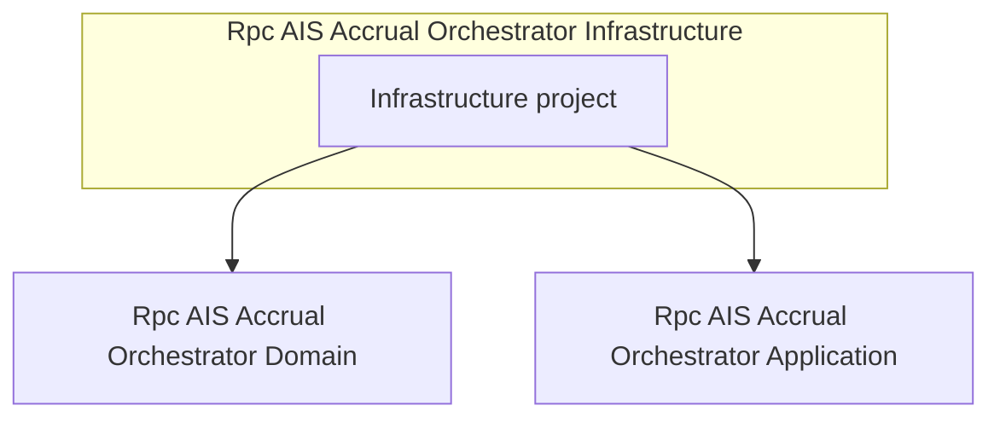

# Rpc.AIS.Accrual.Orchestrator.Infrastructure Feature Documentation

## Overview

The Infrastructure project provides HTTP client abstractions, resilience policies, authentication, email communication, and in-memory caching.

It bridges the core application logic with external services and supports dependency injection for shared infrastructure concerns.

## Architecture Overview



## Component Structure

### 1. Project Definition

```xml
<Project Sdk="Microsoft.NET.Sdk">
  <ItemGroup>
    <ProjectReference Include="..\Rpc.AIS.Accrual.Orchestrator.Domain\Rpc.AIS.Accrual.Orchestrator.Domain.csproj" />
    <ProjectReference Include="..\Rpc.AIS.Accrual.Orchestrator.Application\Rpc.AIS.Accrual.Orchestrator.Application.csproj" />
  </ItemGroup>
  <ItemGroup>
    <PackageReference Include="Microsoft.Extensions.Http" Version="10.0.3" />
    <PackageReference Include="Microsoft.Extensions.Options.ConfigurationExtensions" Version="10.0.3" />
    <PackageReference Include="Microsoft.Extensions.Http.Polly" Version="10.0.3" />
    <PackageReference Include="Polly" Version="8.6.5" />
    <PackageReference Include="Azure.Identity" Version="1.17.1" />
    <PackageReference Include="Azure.Communication.Email" Version="1.1.0" />
    <PackageReference Include="Microsoft.Extensions.Caching.Memory" Version="10.0.3" />
  </ItemGroup>
</Project>
```

### 2. **Project References**

This layer depends on the domain and application projects to access core models and use-case services.

| Reference Path | Layer |
| --- | --- |
| `..\Rpc.AIS.Accrual.Orchestrator.Domain\Rpc.AIS.Accrual.Orchestrator.Domain.csproj` | Domain layer |
| `..\Rpc.AIS.Accrual.Orchestrator.Application\Rpc.AIS.Accrual.Orchestrator.Application.csproj` | Application layer |


### 3. **Package References**

The Infrastructure project brings in external packages for HTTP, resilience, caching, and Azure integrations.

| Package | Version | Responsibility |
| --- | --- | --- |
| Microsoft.Extensions.Http | 10.0.3 | Provides `IHttpClientFactory` and HTTP abstractions |
| Microsoft.Extensions.Options.ConfigurationExtensions | 10.0.3 | Enables `IOptions<T>` binding from configuration sources |
| Microsoft.Extensions.Http.Polly | 10.0.3 | Integrates Polly policies with `HttpClient` |
| Polly | 8.6.5 | Implements resilience and transient-fault handling policies |
| Azure.Identity | 1.17.1 | Supports Azure Active Directory authentication workflows |
| Azure.Communication.Email | 1.1.0 | Provides email sending via Azure Communication Services |
| Microsoft.Extensions.Caching.Memory | 10.0.3 | Offers in-memory caching via `IMemoryCache` |


## Integration Points

- **Domain Layer**: Consumes core domain models and interfaces for payload and policy operations.
- **Application Layer**: Implements higher-level use cases using HTTP clients and caching.
- **External Services**- HTTP-based APIs (e.g., Dataverse, FSCM) via resilient clients
- Azure Identity for secure token acquisition
- Azure Communication Email for notifications

## Dependencies

- .NET SDK (`Microsoft.NET.Sdk`)
- Domain and Application projects within the solution
- NuGet packages for HTTP, resilience, configuration, caching, and Azure services

## Configuration and Usage

- Register HTTP clients using `IHttpClientFactory` and apply Polly retry/circuit-breaker policies.
- Bind configuration sections to options classes via `IOptions<T>` and `OptionsBinder`.
- Use `IMemoryCache` for short-lived caching of lookup data or response results.
- Inject `DefaultAzureCredential` (from Azure.Identity) to authenticate service calls.
- Use `EmailClient` (from Azure.Communication.Email) to send notification messages.

## Key Classes & Services

This project provides infrastructure services and handlers that are consumed by function host and application layers:

| Service / Handler | Location | Purpose |
| --- | --- | --- |
| HTTP client registrations | `Program.cs` in Functions project | Configures base addresses, handlers, and policies |
| `HttpPolicies` | `Rpc.AIS.Accrual.Orchestrator.Infrastructure` | Defines Polly policies for HTTP retry and circuit-breaker strategies |
| Authentication handlers (e.g., `FscmAuthHandler`) | Infrastructure.Clients.* | Adds token acquisition to outgoing HTTP requests |
| `IMemoryCache` integrations | Infrastructure utilities | Caches external lookup responses |
| `AcsEmailSender` | Infrastructure.Notifications | Sends emails via Azure Communication Email |


## Caching Strategy

- Uses `IMemoryCache` for in-process caching.
- Cache entries keyed by request parameters or endpoint name.
- Default TTL configured via options in hosting project.