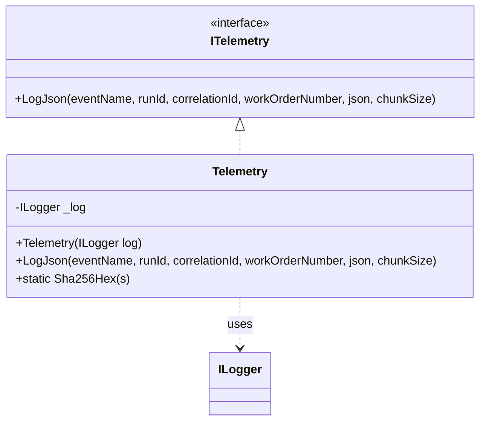

# Telemetry Feature Documentation

## Overview

The **Telemetry** component provides a unified way to log large JSON payloads in manageable chunks, ensuring that no single log entry exceeds size limits. By breaking payloads into configurable chunks and tagging each with metadata (event name, run ID, correlation ID, work order number, SHA-256 hash, chunk index/count), it enables reliable ingestion and tracing of telemetry events across distributed workflows. This implementation fits into the **Infrastructure** layer and implements the `ITelemetry` interface from the **Core.Abstractions** to decouple logging concerns from business logic.

## Architecture Overview

```mermaid
flowchart TB
    subgraph Core Layer
        ITelemetry[ITelemetry Interface]
    end

    subgraph Infrastructure Layer
        Telemetry[Telemetry Class]
    end

    subgraph Application Layer
        UseCases[FsaDeltaPayloadUseCase<br/>and others]
    end

    ITelemetry <|-- Telemetry
    UseCases -->|injects| ITelemetry
    Telemetry -->|uses| ILogger[ILogger\<Telemetry>]
```

## Component Structure

### Telemetry (`src/Rpc.AIS.Accrual.Orchestrator.Infrastructure/Telemetry.cs`)

- **Purpose**: Implements `ITelemetry` to log JSON payloads in chunks with rich metadata.
- **Dependencies**:- `ILogger<Telemetry>` for log emission.
- `SHA256` and `Encoding.UTF8` to compute payload hash.
- **Registration**: Registered in DI as the concrete `ITelemetry` (e.g. via `services.AddSingleton<ITelemetry, Telemetry>()`).

#### Constructor

| Parameter | Type | Description |
| --- | --- | --- |
| `log` | `ILogger<Telemetry>` | Logger from DI container; throws if null. |


#### Methods

| Method | Signature | Description |
| --- | --- | --- |
| `LogJson` | `void LogJson(string eventName, string runId, string correlationId, string? workOrderNumber, string json, int chunkSize = 7000)` | Splits `json` into `chunkSize`-sized parts; logs each with metadata and SHA-256 hash. |
| `Sha256Hex` | `public static string Sha256Hex(string s)` | Computes lowercase hex string of SHA-256 digest of UTF-8 bytes of `s`. |


## Method Details

### LogJson

Logs a JSON payload in sequential chunks to prevent oversized log entries.

- **Steps**:1. Compute SHA-256 hex of entire `json`.
2. Calculate number of chunks:

`chunks = Ceil(json.Length / chunkSize)`.

1. Loop `i` from `0` to `chunks-1`:- Extract `part = json.Substring(i * chunkSize, min(chunkSize, remaining))`.
- Emit `_log.LogInformation` with template:

```plaintext
       {EventName} JSON_CHUNK RunId={RunId} CorrelationId={CorrelationId}
       WorkOrderNumber={WorkOrderNumber} JsonHash={JsonHash}
       ChunkIndex={ChunkIndex} ChunkCount={ChunkCount} Chunk={Chunk}
```

- **Placeholders**:- `EventName`, `RunId`, `CorrelationId`, `WorkOrderNumber`, `JsonHash`
- `ChunkIndex`, `ChunkCount`, `Chunk` (actual JSON substring)

```csharp
public void LogJson(
    string eventName,
    string runId,
    string correlationId,
    string? workOrderNumber,
    string json,
    int chunkSize = 7000)
{
    var hash = Sha256Hex(json);
    var total = json.Length;
    var chunks = (int)Math.Ceiling(total / (double)chunkSize);

    for (int i = 0; i < chunks; i++)
    {
        var part = json.Substring(i * chunkSize,
            Math.Min(chunkSize, total - i * chunkSize));
        _log.LogInformation(
            "{EventName} JSON_CHUNK RunId={RunId} CorrelationId={CorrelationId} " +
            "WorkOrderNumber={WorkOrderNumber} JsonHash={JsonHash} " +
            "ChunkIndex={ChunkIndex} ChunkCount={ChunkCount} Chunk={Chunk}",
            eventName, runId, correlationId, workOrderNumber,
            hash, i, chunks, part);
    }
}
```

### Sha256Hex

Produces a SHA-256 hash in hex form.

- **Algorithm**:- Create `SHA256` instance.
- Compute hash over `Encoding.UTF8.GetBytes(s)`.
- Convert to lowercase hex via `Convert.ToHexString(b).ToLowerInvariant()`.

```csharp
public static string Sha256Hex(string s)
{
    using var sha = SHA256.Create();
    var b = sha.ComputeHash(Encoding.UTF8.GetBytes(s));
    return Convert.ToHexString(b).ToLowerInvariant();
}
```

## Class Diagram



## Dependencies & Integration

- **Core.Abstractions**: Implements `ITelemetry` from `Rpc.AIS.Accrual.Orchestrator.Core.Abstractions`.
- **Logging**: Relies on `Microsoft.Extensions.Logging.ILogger<Telemetry>`.
- **Injection**: Registered in the host’s DI container to be injected into use cases (e.g., `FsaDeltaPayloadUseCase`).
- **Usage**: Business workflows call `LogJson` to record payload snapshots, e.g.:

```csharp
  _telemetry.LogJson(
      "Dataverse.OpenWorkOrders",
      runId,
      correlationId,
      workOrderNumber: null,
      json: openWoHeaders.RootElement.GetRawText()
  );
```

## Error Handling

- **Constructor**: Throws `ArgumentNullException` if `ILogger<Telemetry>` is null.
- **LogJson**: Assumes non-null `json`; unhandled `ArgumentOutOfRangeException` if indices invalid.
- **Sha256Hex**: May throw if string encoding fails or SHA-256 creation fails.

## Performance Considerations

- **Chunk Size**: Default `7000` chars balances between log size limits and number of entries.
- **Hashing**: Single SHA-256 computation per payload; overhead minimal relative to payload size.
- **Looping**: Splitting and substring operations scale linearly with payload length.

## Key Classes Reference

| Class | Location | Responsibility |
| --- | --- | --- |
| **Telemetry** | `src/Rpc.AIS.Accrual.Orchestrator.Infrastructure/Telemetry.cs` | Implements `ITelemetry`; logs JSON in chunks. |
| **ITelemetry** | `src/Rpc.AIS.Accrual.Orchestrator.Application/Ports/Common/Abstractions/ITelemetry.cs` | Defines telemetry contract. |


---

❤️ Thank you for exploring the Telemetry component!